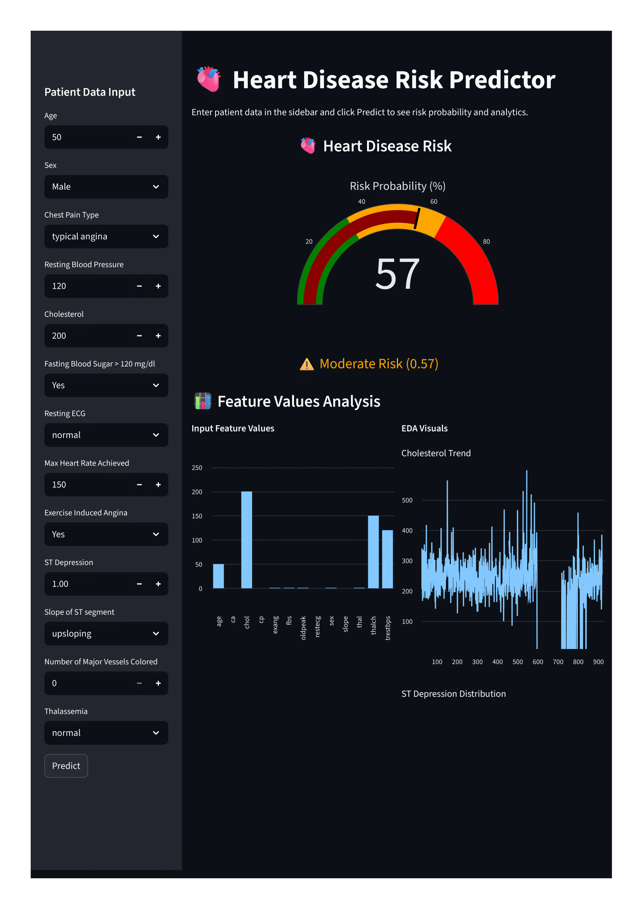

 
# 🫀 Heart Disease Risk Predictor

**Predict the risk of heart disease using patient clinical data.**  
Interactive analytics dashboard with probability gauge and key feature visualizations.

---

## 🔹 Key Features
- Predicts heart disease risk probability from patient data.
- Color-coded risk levels: Low / Moderate / High.
- Interactive probability gauge using Plotly.
- EDA charts for key clinical features.
- Clear, user-friendly interface to view predictions and analytics.

---

## 🔹 Skills Demonstrated
- **Data Science:** Data preprocessing, feature mapping, exploratory data analysis.
- **Machine Learning:** Random Forest classification for risk prediction.
- **Data Visualization:** Line charts, bar charts, interactive gauge charts.
- **Python Libraries:** Pandas, NumPy, Scikit-learn, Plotly, Streamlit.
- **Healthcare Analytics:** Risk prediction from clinical parameters.

---

## 🔹 Example Input & Output

| Feature | Value |
|---------|-------|
| Age | 50 |
| Sex | Male |
| Chest Pain Type | typical-anginal |
| Resting Blood Pressure | 120 |
| Cholesterol | 200 |
| Fasting Blood Sugar | Yes |
| Resting ECG | normal |
| Max Heart Rate Achieved | 150 |
| Exercise Induced Angina | Yes |
| ST Depression | 1.00 |
| Slope of ST segment | upsloping |
| Number of Major Vessels | 0 |
| Thalassemia | normal |

**Expected Output:**  
- Risk Probability: 57%  
- Risk Level: Moderate Risk
  
## **Screenshot**


---

## 🔹 How to Run
1. Clone the repository:
```bash
git clone https://github.com/<gayatri9911>/heart-disease-risk-predictor.git
